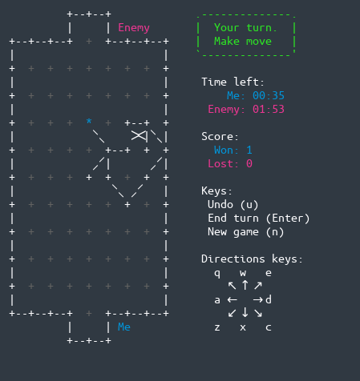

## paper-soccer
A free networked version of paper soccer game in modern console.

<p align="center">

</p>

## Requirements
- `gcc` with `C++20` support
- `googletest` (1.10.0)
- `boost` (1.67)
    - `boost.asio`
    - `boost.serialization`
    - `boost.program_options`
- `ncurses` (6.2)
- also terminal supporting font fallback (weird Unicode characters are used)

## Installation Google Test
```
cd paper-soccer/lib/
git clone https://github.com/google/googletest.git
cd googletest/
cmake CMakeLists.txt
make
```

## Installation
```
cmake CMakeLists.txt
make
```

## Example
Run as server and wait for connection (default port `8787`)
```
./src/paper-soccer -w

# Equivalent
./src/paper-soccer -w -p 8787
```

Connect to localhost server
```
./src/paper-soccer -c localhost

# Equivalent
./src/paper-soccer -c localhost -p 8787
```

### Game control

Key | Direction
--- | ---
<kbd>n</kbd> | New game
<kbd>Enter</kbd> | End trun
<kbd>u</kbd> | Undo player move

### Ball movements

Ball placement can be changed by mouse or keyboard.

Key | Direction
--- | ---
<kbd>w</kbd> | Top
<kbd>x</kbd> | Bottom
<kbd>a</kbd> | Left
<kbd>d</kbd> | Right
<kbd>q</kbd> | Top-Left
<kbd>e</kbd> | Top-Right
<kbd>z</kbd> | Bottom-Left
<kbd>c</kbd> | Bottom-Right

## Code style settings
```
clang-format -style='{BasedOnStyle: WebKit, Cpp11BracedListStyle: true, SpaceBeforeCpp11BracedList: false}' -i *.?pp
```